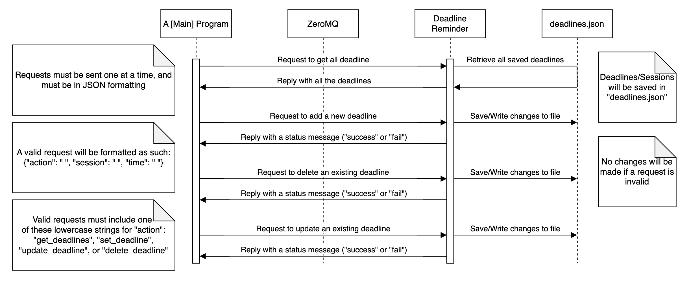

# Deadline Reminder

Deadline Reminder is a microservice that stores and retrieves deadlines. It can send deadline reminders, add new deadlines, update existing deadlines, or delete existing deadlines.

## Content

- [Setup](#setup)
  - [Requirements](#requirements)
  - [Execution](#execution)
- [Usage](#usage)
  - [Requesting Data](#requesting-data)
  - [Receiving Data](#receiving-data)
- [UML Sequence Diagram](#uml-sequence-diagram)

## Setup

### Requirements

1. You can run this microservice locally using a terminal or an IDE.
2. Ensure that [Python](https://www.python.org/) 3.12 is installed on your system.
3. This microservice uses ZeroMQ as its communication pipeline. Please make sure that [ZeroMQ](https://zeromq.org/download/) is installed on your system.
4. Do not move, change, rename. or delete the "deadlines.json" file without making the necessary changes to "deadline_reminder.py" to accommodate.
5. Ensure the port that is being used by the microservice and ZeroMQ is open/available. If not, use a different port.

### Execution

Run the microservice in your terminal of choice using the following command:


```bash
python3 deadline_reminder.py
```

To stop the process, use the following keys on your keyboard: Ctrl+C

## Usage

### Requesting Data

Once the microservice is up and running, you can send it requests by connecting to it via ZeroMQ.

For guidance on establishing a connection with the microservice, refer to [ZeroMQ's documentation](https://zeromq.org/get-started/?language=python&library=pyzmq#). Additionally, refer to the "test_main.py" file for an example, and to see everything in action.

To send a request, the request must be in the form of a JSON: {"key": "value"}

The request should at least have the following: {"action": "[something]"}

The microservice will look for the following values for "action" (replace with "[something]"):

- "get_deadlines"
- "set_deadline"
- "update_deadline"
- "delete_deadline"

If the value for "action" does not match any of the strings mentioned above, the microservice will send back an error.

Send a request using the following structure:

- To get all the current deadlines: {"action": "get_deadlines"}
- To add a new deadline: {"action": "set_deadline", "session": "[new session name]", "time": "[new time value]"}
- To update an existing deadline: {"action": "get_deadline", "session": "[session name]", "time": "[time value]"}
- To delete an existing deadline: {"action": "set_deadline", "session": "[session name]"}

To send a request, use the following outline [for Python]:

```python
request = {"action": "get_deadlines"}
socket.socket.send_json(request)
```

Example Request: {"action": "set_deadline", "session": "Physics Study", "time": "2025-02-08T10:00:00"}

### Receiving Data

Receiving data from the microservice is simple.

After a request has been sent to the microservice, it will send back a response.

You can use the following outline to catch that response:

```python
reply = socket.recv_json()
```

You can then use something like the following to display the response:

```python
reply = socket.recv_json()
print(json.dumps(reply, indent=4))  # note that you would need to import "json" for "dumps"
```

That's it!

## UML Sequence Diagram


